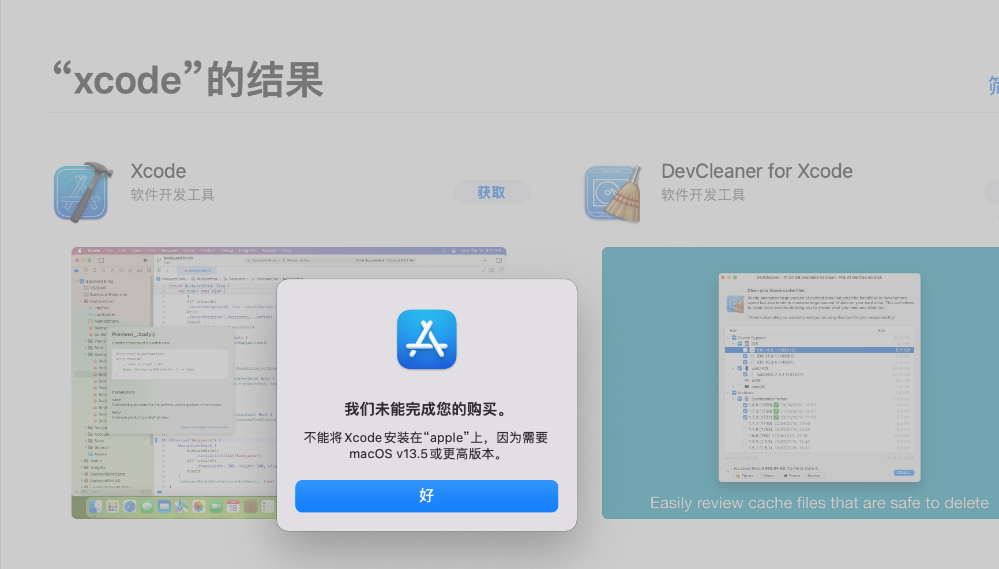
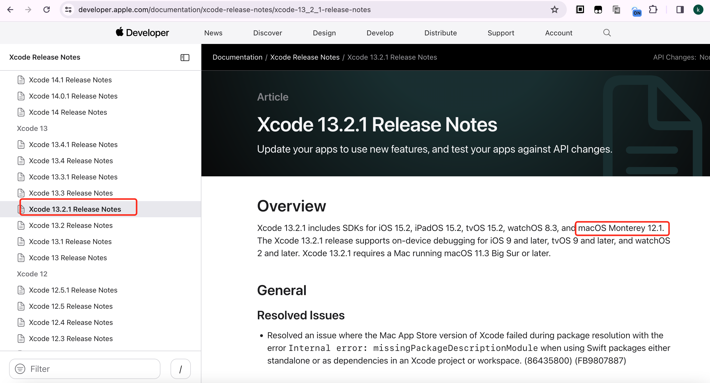
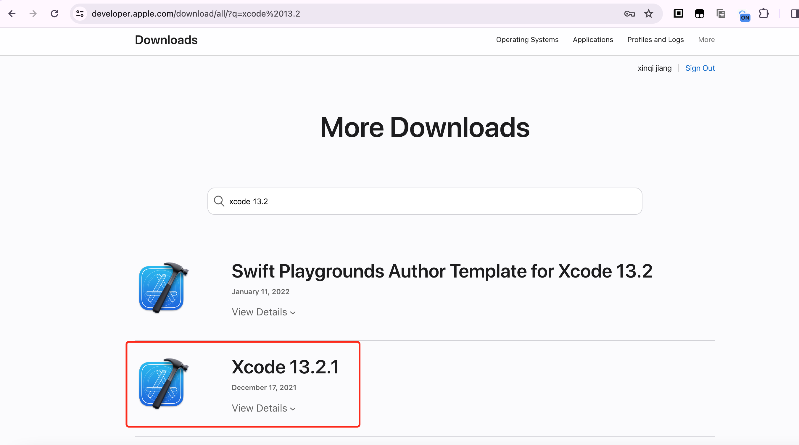

# react-native环境搭建


1. 安装brew 用于安装一下第三方的工具

2. 安装node 


1. 安装react-native-cli
```sh
npm install -g react-native-cli
```

2. 安装brew 用于安装git node等第三方的工具 

3. 安装node watchman
【Watchman是由 Facebook 提供的监视文件系统变更的工具】
安装此工具可以提高开发时的性能（packager 可以快速捕捉文件的变化从而实现实时刷新）。使用brew安装
```sh
brew install node@16
brew install watchman
```

## ios环境搭建
1. 安装Xcode
2. 安装cocoapods

## android环境搭建
1. 安装JDK
2. 安装Android Studio
3. 安装Android SDK

## 问题记录
1. 旧版的Mac系统在appstore上下载xcode时，会遇到版本过低但情况，无法安装

解决办法：
打开 Apple Developer Documentation【https://developer.apple.com/documentation/xcode-release-notes/】 网站

逐个点击每个大版本的最低小版本，看到有自己的系统（如Mojave 10.14.x）时，可以再在这个大版本里面找一个最新的，自己mac系统可以用的版本


转到Sign In - Apple【https://developer.apple.com/download/all/?q=xcode%2013.2】



